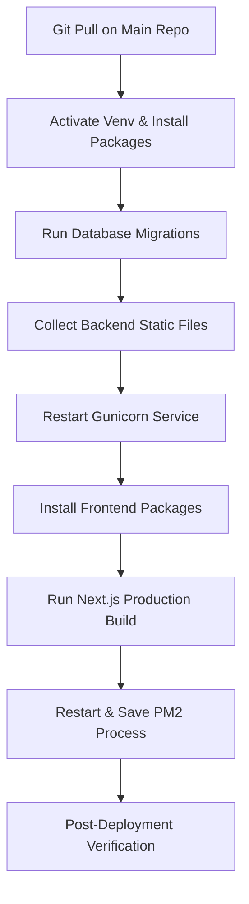

# IKAAI INDIA – Production Deployment & Maintenance Guide

**Project:** IKAAI INDIA CMS & Website  
**Last Updated:** July 2026  
**Maintainer:** Lokesh Rathi  

---

> [!NOTE]
> This document serves as the official deployment and maintenance guide for the IKAAI INDIA production environment. Follow these guidelines carefully to minimize downtime and ensure system integrity during updates.

---

## 🖥️ Server & Environment Overview

### Production Infrastructure Details

| Component | Technology / Config | Purpose |
| :--- | :--- | :--- |
| **OS** | Ubuntu 24.04 LTS | Core Operating System |
| **Web Server** | Nginx | Reverse Proxy & SSL Termination |
| **Backend API** | Django 5.x + DRF | Content Management & Public APIs |
| **Frontend Web** | Next.js 14+ | Server-Side Rendered Public Website |
| **WSGI Gateway** | Gunicorn | Python Application Server |
| **Process Manager** | PM2 | Next.js Service Monitoring |
| **Database Engine**| PostgreSQL | Relational Database Store |
| **App Repository** | `/var/www/ikaai-v2` | Application Code Root |
| **Primary Domain** | `https://ikaaiindia.in` | Public-Facing Website URL |

### Directory & File Locations

* **Frontend Root:** `/var/www/ikaai-v2/client`
* **Backend Root:** `/var/www/ikaai-v2/server`
* **Python Virtual Environment:** `/var/www/ikaai-v2/server/.venv`
* **Django Static Target:** `/var/www/ikaai-v2/server/staticfiles`
* **User Media Uploads:** `/var/www/uploads`
* **Nginx Configuration:** `/etc/nginx/sites-enabled/default`
* **Gunicorn Systemd Service:** `/etc/systemd/system/ikaai-gunicorn.service`

### Services Management

| Service | Daemon/Process Name | Restart Command |
| :--- | :--- | :--- |
| **Nginx** | `nginx` | `sudo systemctl restart nginx` |
| **Gunicorn** | `ikaai-gunicorn` | `sudo systemctl restart ikaai-gunicorn` |
| **PM2 (Next.js)** | `ikaai-frontend` | `pm2 restart ikaai-frontend` |
| **Database** | `postgresql` | *Do not restart unless required* |

---

## 🔄 Deployment Workflow

Always execute deployments in the following order to ensure database migrations are completed before the new code is loaded.



### 📋 Full Command Cheat Sheet

Run this sequence of commands from your terminal:

```bash
# Navigate to the project root and pull latest commits
cd /var/www/ikaai-v2
git pull origin main

# --- Backend Operations ---
cd server
source .venv/bin/activate
pip install -r requirements.txt
python manage.py migrate
python manage.py collectstatic --noinput
sudo systemctl restart ikaai-gunicorn

# --- Frontend Operations ---
cd ../client
npm install
npm run build
pm2 restart ikaai-frontend
pm2 save
```

---

## 🛠️ Step-by-Step Procedure

### Step 1: Code Retrieval
Navigate to the root directory `/var/www/ikaai-v2`. Always run Git commands here; **do not** run `git pull` directly inside `client/` or `server/` subfolders as they are part of the single monorepo.
```bash
cd /var/www/ikaai-v2
git pull origin main
```

### Step 2: Backend & Database Deployment
Switch to the server directory, activate the environment, install any new packages, apply migrations, and update static assets:
```bash
cd server
source .venv/bin/activate

# Only needed if requirements.txt changed
pip install -r requirements.txt

# Only needed if models or migrations changed
python manage.py migrate

# Safe to run every deployment
python manage.py collectstatic --noinput

# Restart backend process
sudo systemctl restart ikaai-gunicorn
```

### Step 3: Frontend Deployment
Switch to the client directory, install updated packages, build the production bundle, and reload PM2:
```bash
cd ../client

# Only needed if package.json or package-lock.json changed
npm install

# Run compilation
npm run build

# Restart the live server process
pm2 restart ikaai-frontend
pm2 save
```

---

## 🚦 Action Trigger Matrix

Use this matrix to determine exactly which steps are required based on which files changed:

| File / Component Changed | Action Required |
| :--- | :--- |
| **React Component / Page** | `npm run build` + `pm2 restart ikaai-frontend` |
| **Tailwind Config / CSS** | `npm run build` + `pm2 restart ikaai-frontend` |
| **Next.js Config / Metadata**| `npm run build` + `pm2 restart ikaai-frontend` |
| **package.json / package-lock**| `npm install` + `npm run build` + `pm2 restart` |
| **requirements.txt** | `pip install -r requirements.txt` + restart Gunicorn |
| **Django View / Selector / Service**| `sudo systemctl restart ikaai-gunicorn` |
| **Django Model / Field** | `python manage.py migrate` + restart Gunicorn |
| **Django Admin CSS / JS / Media**| `python manage.py collectstatic --noinput` |

---

## 💬 Command Reference Guide

### Gunicorn (Backend)
```bash
# Check status
sudo systemctl status ikaai-gunicorn

# Restart service
sudo systemctl restart ikaai-gunicorn

# View live Gunicorn logs
sudo journalctl -u ikaai-gunicorn -f
```

### PM2 (Frontend Next.js)
```bash
# List active processes
pm2 list

# Restart frontend process
pm2 restart ikaai-frontend

# View live frontend logs
pm2 logs ikaai-frontend

# Save current process list for autostart
pm2 save
```

### Nginx (Web Server)
```bash
# Test configurations for syntax errors
sudo nginx -t

# Hot-reload configuration without downtime
sudo systemctl reload nginx

# Full restart
sudo systemctl restart nginx

# View error logs
sudo tail -f /var/log/nginx/error.log
```

---

## ⚠️ Troubleshooting & Warnings

### Common Resolution Steps

* **`502 Bad Gateway`**
  This usually means Gunicorn is stopped. Restart it:
  ```bash
  sudo systemctl restart ikaai-gunicorn
  ```
* **Frontend changes not showing up**
  Confirm that `npm run build` and `pm2 restart ikaai-frontend` completed successfully.
* **`EADDRINUSE` Port Conflicts**
  Occurs if a duplicate process tries to bind to port 3000. Inspect and kill orphaned instances:
  ```bash
  pm2 list
  sudo lsof -i :3000
  ```
* **`collectstatic` duplicate warnings**
  Warnings like *Found another file with destination path...* are standard when overrides exist and can be safely ignored.

### 🚫 Things Never to Do

> [!CAUTION]
> * **Never** run `git pull` from inside the subdirectories `client/` or `server/`.
> * **Never** use `pm2 start` during a deploy. Use `pm2 restart` to prevent spawning duplicate server processes.
> * **Never** edit the production database schema manually. Always write and run Django migrations.
> * **Never** delete `/var/www/uploads` or local media without taking a secure remote backup first.
> * **Never** commit or push the production `.env` file to source control.

---

## 🗄️ Backup Protocols

Always back up the following critical components before performing major migrations, structural database changes, or system updates:

1. **PostgreSQL Database:** Export current schemas and content.
2. **Media Assets:** `/var/www/uploads`
3. **Environment Files:** `/var/www/ikaai-v2/server/.env`
4. **Nginx configs:** `/etc/nginx/sites-enabled/default`